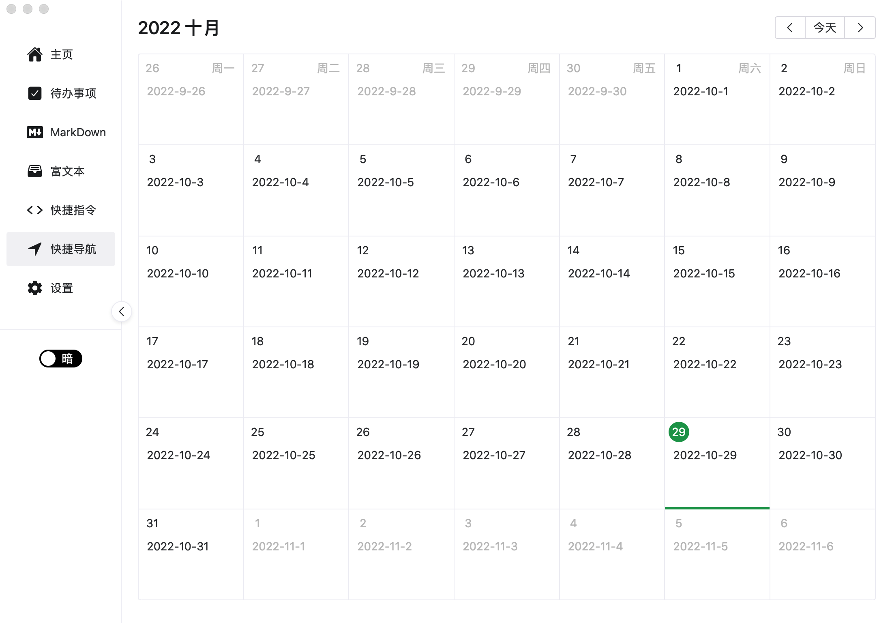
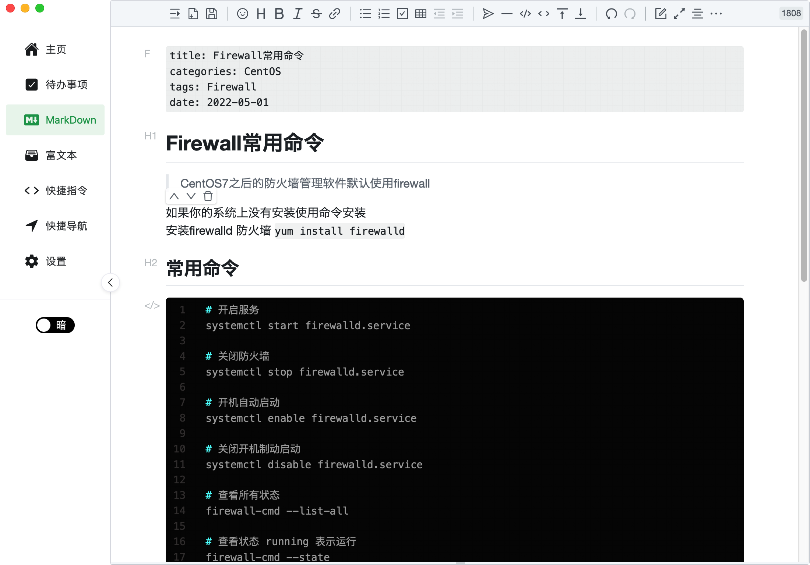
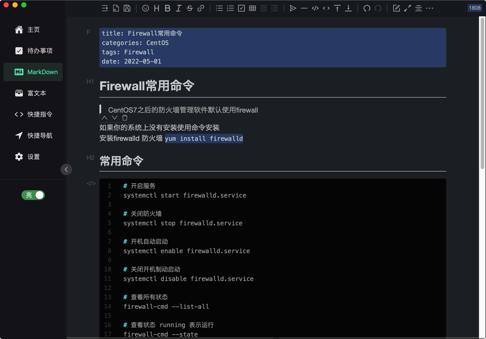
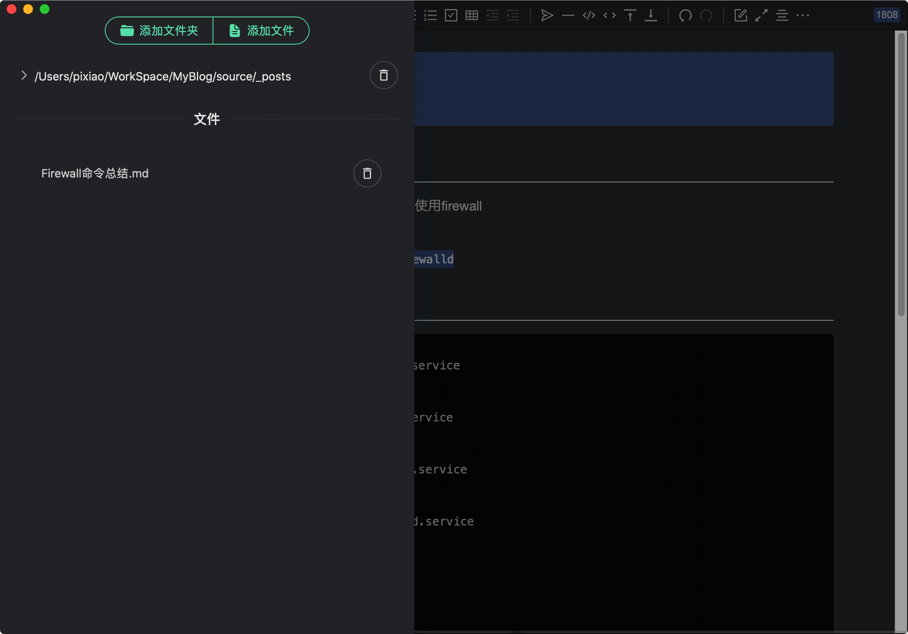

# GTools开发说明

<a href='https://gitee.com/pixiao/gtools/stargazers'></img></a>
<a href='https://gitee.com/pixiao/gtools/members'></img></a>

> Gitee地址：https://gitee.com/pixiao/gtools
> 
> GitHub地址：https://github.com/Pixiao3668/GTools

## 简介

GTools是基于wails开发的一款跨平台（Mac、Windows、Linux）桌面小工具

- 功能完善（我需要的功能都有，没有的也在开发的路上，没在路上也在计划上）
- 可执行包体积小（wails开发8M起步，我就喜欢小钢炮）
- 开发难度小（会点go、vue即可快速开发）
- 可扩展性高（vue实现不了的go实现，go实现不了的三方服务实现）
- 跨平台（Mac打包Mac用，Windows打包Windows用，Linux打包Linux用）

## 需求

我想用的功能N合一，不要那么多花哨的主题，亮暗即可（我要是会前端我整的还花哨）
不要广告、不要订阅、不要插件（专注细节，专注产品，每一个功能都要精雕细琢）
如果姊妹们有什么好想法可以加企鹅群讨论：736733848

## 开发

- MacOS/Windows
- Vscode
- wails v2.1.0
- golang 1.18
- Vue 3.2.37
- Naive UI
- Element-plus

## TODO

- [X] Markdown编辑器增加阿里云OSS图片上传功能
- [X] Markdown编辑器增加目录功能
- [X] Markdown编辑器增加失去焦点保存功能
- [X] Markdown编辑器增加创建、保存文档功能
- [X] 使用Naive UI下拉框实现Markdown编辑器的文件树功能
- [X] 实现添加文件夹和文件功能
- [ ] Markdown文本的PDF、HTML导出功能
- [ ] markdown基于百度翻译的实时翻译功能
- [ ] 使用MilkDown重新实现md编辑器功能
- [X] 将markdown的存储方式由json改为sqlite3
- [X] 重构Golang后端代码结构
- [ ] 实现软件设置的可视化配置
- [ ] 增加Markdown编辑器图片上传和本地路径存储的选项
- [ ] 富文本编辑器的文件增删改查功能实现
- [X] 使用xorm替代json文件进行数据的存储
- [ ] 增加时钟功能
- [ ] 增加倒计时结束后系统通知功能
- [ ] 使用go-toast实现系统通知功能
- [ ] 多线程文件下载器和磁力下载器
- [ ] 增加快捷笔记、快捷代码段功能
- [ ] 增加PDF阅读器功能(非必要)
- [ ] 快捷指令增、删、改、查、运行、停止功能
- [X] 待办事项清单分组、增、删、改、查功能
- [ ] 待办事项增加项目分类功能
- [ ] 集成tutuList功能
- [ ] Json格式化小工具
- [ ] 图片-Base64转换工具
- [ ] 房贷计算器小工具
- [ ] 基于百度OCR的图片精准转文字小工具
- [ ] 更多的功能拓展
- [ ] 完善Log日志提示
- [ ] 精简前端后端包结构，继续减小包体积

## 界面展示

## 欢迎交流讨论

企鹅群：736733848（GTools交流群）
