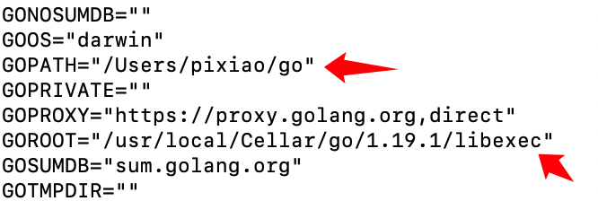

# 开发环境

## 系统基本配置

### MacOS 
- Golang 1.18+
- Nodejs 15+

### Windows
- Golang 1.18+
- Nodejs 15+
- GCC

### Ubuntu
- Golang 1.18+
- Nodejs 15+
- GCC
- 内存4G+

## 安装Golang

### MacOS

**brew安装**

```
brew install go
```

**查看go版本**

```
brew info go
```

**查看go配置**

```
go env
```

> 重点查看 `GOPATH` 和 `GOROOT` 的路径



**添加环境变量**

打开配置文件
```
open ~/.bash_profile
```
添加如下语句
```
export GOROOT=/usr/local/Cellar/go/1.19.1/libexec
export GOPATH=$HOME/go
export PATH=$PATH:$GOROOT/bin
```

配置生效
```
source ~/.bash_profile
```

### Windows

Golang下载：https://golang.google.cn/dl/

选择 `.msi` 格式安装包，选择适合的 `Arch` 版本


### Ubuntu

## 安装NodeJs

### MacOS

**brew安装**

```
brew install node
```
**查看node版本**
```
node -v
```
**查看npm版本**
```
npm -v
```

### Windows

### Ubuntu